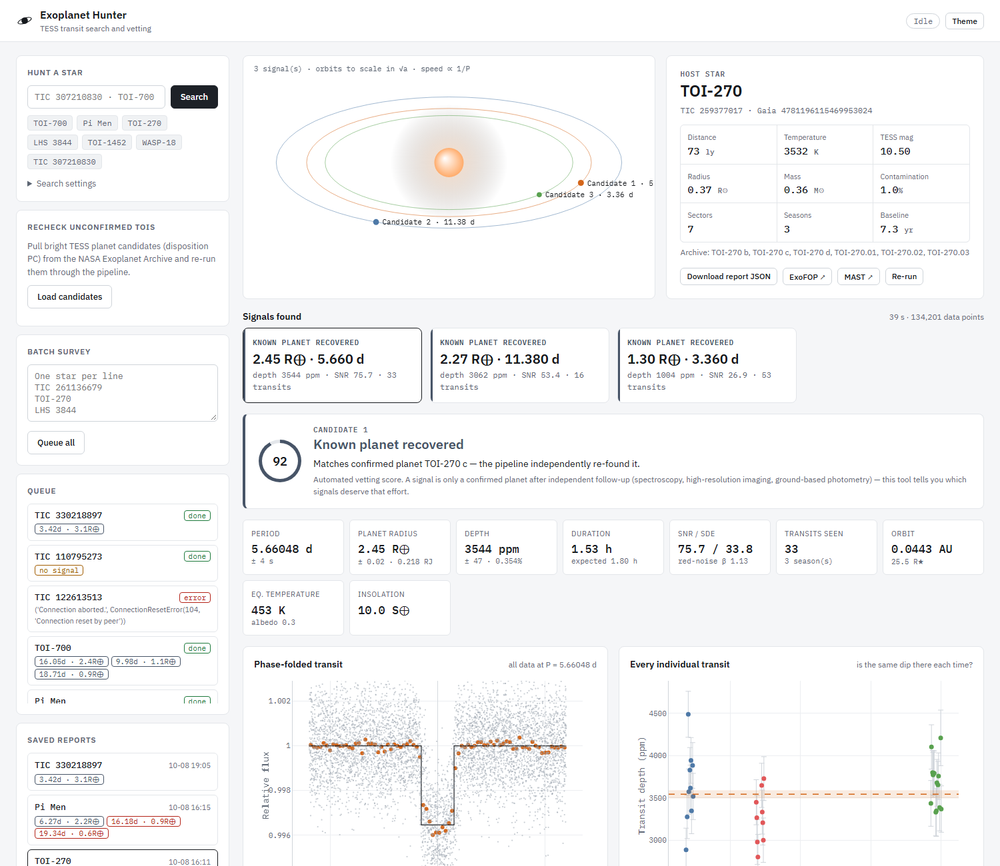

# Exoplanet Hunter

Searches NASA TESS light curves for transiting planets, runs false-positive checks on each signal,
rechecks it in every observing season, and cross-matches it with the NASA Exoplanet Archive.



## Usage

```bash
./run.sh        # Linux / macOS / WSL
run.bat         # Windows
```

Open http://localhost:8000 and enter a TIC ID, TOI number or star name.

Command line:

```bash
.venv/bin/python cli.py "TOI-270"
```

## Pipeline

1. Download all TESS sectors from MAST (SPOC, TESS-SPOC, QLP)
2. Detrend and clean the light curves
3. BLS search, stacked across observing seasons
4. Refine period and transit time over the full baseline
5. Vetting: SNR, odd/even depth, secondary eclipse, transit shape, single-event check,
   duration vs. stellar density, per-season recheck
6. Cross-match against confirmed planets and TOIs

## Contributing a candidate

Each signal has a Contribute panel:

1. ExoFOP readiness checks: not a known planet, TOI or community TOI (including harmonics), vetting passed,
   period/epoch/depth/duration all measured, SNR, multi-season detection, contamination.
2. Package download: a Research Note of the AAS draft (AASTeX) with figure, an ExoFOP parameter sheet using
   ExoFOP's column names, the folded light curve and the full candidate data.
3. Zenodo upload for a DOI that timestamps the finding.
4. Links for the RNAAS submission and the ExoFOP community-candidate upload (ExoFOP requires the candidate to
   be published first), plus citizen-science follow-up projects.

## Tested on

| Star | Result |
|---|---|
| TOI-270 | b, c, d recovered |
| Pi Men | c recovered |
| TOI-700 | b, c recovered; d found at half period |
| TOI-1385 | flagged as a known false positive |

## Limitations

- A passing signal is a candidate, not a confirmed planet. Confirmation needs follow-up observations.
- No pixel-level centroid test.
- Box transit model, so radii are approximate.
- Needs at least 2 transits per season.
